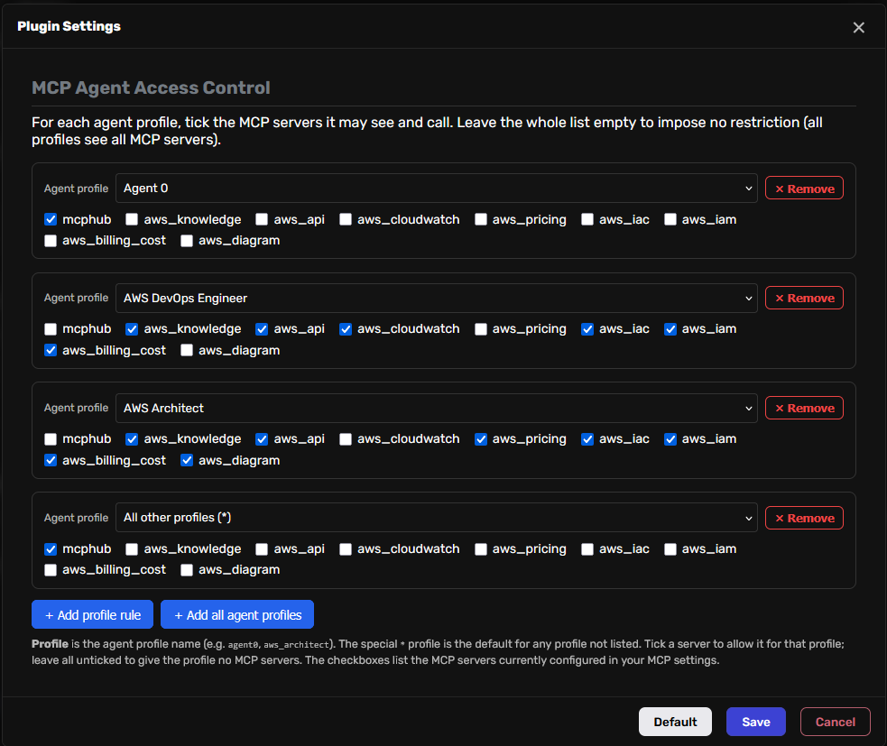

# MCP Agent Access Control

<p align="center">
  
</p>

Per-agent / per-profile **whitelist for MCP servers** in [Agent Zero](https://github.com/agent0ai/agent-zero).

<div align="center">

[](https://www.buymeacoffee.com/mirecekdg) [](https://www.paypal.com/donate/?business=LJ5ZF7Q9KMTRW&no_recurring=0&currency_code=USD)

</div>

Agent Zero registers MCP servers **globally** (in Settings → `mcp_servers`), so by default every agent — including the top-level `agent0` — sees every MCP server's tools in its system prompt. This plugin lets you scope MCP servers to **specific agent profiles**, so e.g. AWS MCP servers are available only to your AWS agents while `agent0` stays clean.

## Why

- **Keep agent0 lean** — don't pollute the main agent's prompt/context with dozens of specialized MCP tools it never uses.
- **Scope tools to specialists** — give each agent profile exactly the MCP servers it needs.
- **Defense in depth** — a disallowed MCP tool is both hidden from the prompt *and* hard-blocked at execution time.

## How it works

The plugin adds two extensions:

1. **Prompt filter** (`system_prompt` hook, via the `@extensible` `build_prompt` end hook in `_12_mcp_prompt`) — rewrites the MCP tools block so each agent only sees the servers its profile is allowed to use.
2. **Execution gate** (`tool_execute_before` hook) — if a model still tries to call an MCP tool whose server is not whitelisted for the profile, the call is rejected with a clear message.

MCP servers themselves stay configured globally (so their clients still start). The plugin only controls **visibility and use** per profile.

## Configuration

Edit the whitelist in **Settings → MCP → MCP Agent Access Control**, or in `default_config.yaml` as a fallback.

The config key is `access_map`: a mapping of **agent profile name → list of allowed MCP server names** (server names exactly as they appear under `mcpServers` in your `mcp_servers` setting).

```yaml
access_map:
  agent0:
    - mcphub
  aws_architect:
    - aws-knowledge
    - aws-pricing
    - aws-iac
    - aws-api
    - aws-diagram
  aws_devops:
    - aws-api
    - aws-cloudwatch
    - aws-iam
    - aws-iac
    - aws-pricing
    - aws-billing-cost
  "*":            # default for any profile not listed
    - mcphub
```

### Rules

- Keys are **agent profile names** (e.g. `agent0`, `aws_architect`, `developer`).
- The special `"*"` key is the **default** applied to any profile with no explicit entry.
- If `access_map` is **empty or unset**, the plugin imposes **no restriction** (allow-all) — installing it without configuration never silently hides tools.
- To give a profile **no** MCP servers, map it to an empty list.

## Installation

- **From the Plugin Hub**: open **Settings → Plugins → Browse**, find *MCP Agent Access Control*, and install.
- **Manual**: copy this repository's contents into `/a0/usr/plugins/mcp_agent_access/` and reload Agent Zero.

After install/edit, reload Agent Zero so extensions are picked up.

## Notes

- Server names in `access_map` must match the keys in your global `mcp_servers` config exactly.
- The plugin never starts or stops MCP servers; it only filters what each profile can see and call.
- Profile resolution uses the agent's profile (falling back to `agent0` for the top-level agent).

## Support

If you find this plugin useful, consider supporting its development:

<div align="center">

[](https://www.buymeacoffee.com/mirecekdg) [](https://www.paypal.com/donate/?business=LJ5ZF7Q9KMTRW&no_recurring=0&currency_code=USD)

</div>

## Screenshots

<p align="center">
  
</p>

## License

MIT — see [LICENSE](LICENSE).
